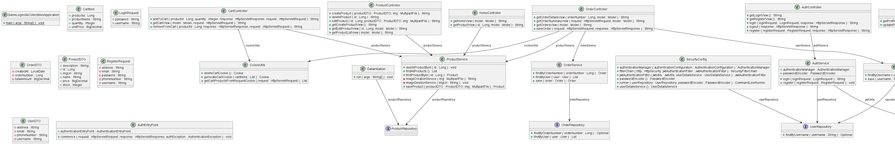
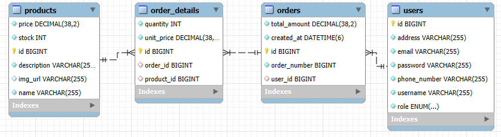

## Game Legends Collectibles

## Description
This project is an ecommerce application based on Spring Boot. It deploys a web server at http://localhost:8080/ that allows users to register, login, manage their profile, and make simulated online purchases. It also includes functionality to manage products, orders and the shopping cart. The project views are implemented using Thymeleaf.

## Features

- **Authentication and Authorization**: Login, register and manage users with roles (admin and user).
- **Product Management**: Create, edit, delete and list products in inventory.
- **Shopping Cart**: Add, delete products and view the cart.
- **Ordering**: Place orders, view details and summaries.
- **User Interface**: Controllers that manage views for each functionality.

## Architecture

The application is composed of several interconnected modules. The main classes and their responsibilities are described below:

### Controllers
- **AuthController**: Management of views and actions related to login, registration and logout.
- **CartController**: Add and remove products from the cart.
- **HomeController**: Home views and product details.
- **OrderController**: Purchase order management.
- **ProductController**: Create, edit, delete products.
- **UserController**: User profile update and display.

### Services
- **AuthService**: Logic to manage user login and registration.
- **OrderService**: Logic to manage orders.
- **ProductService**: Logic for product management.
- **UserService**: Logic for user management.

### Repositories
- **OrderRepository**: Interface for order management in the database.
- **ProductRepository**: Repository to manage products.
- **UserRepository**: Repository to manage users.

### Utilities
- **CookieUtils**: Utilities to manage shopping cart cookies.
- **JwtUtils**: Utilities for JWT generation and validation.

### Data Classes
- **Order**: Represents a purchase order.
- **Product**: Represents a product in the inventory.
- **User**: Represents a system user.

### Security Entities
- **JwtAuthenticationFilter**: Filter for JWT authentication.
- **SecurityConfig**: Security configuration for authentication and authorization.

## Views with Thymeleaf
The application views are implemented using **Thymeleaf**. This template engine allows to easily integrate data from the backend to the frontend views, dynamically and efficiently. The application controllers return Thymeleaf views to represent information as follows:

- **Home View**: `index.html`.
- **Authentication Views**: `login.html`, `register.html`.
- **Cart Views**: `cart.html`.
- **Product Views**: `product-list.html`,`product-create.html`,`product-edit.html`,`product.html`.
- **Order Views**: `orders.html`,`order-details.html`,`order-summary.html`.
- **User Profile Views**: `profile.html`.

## Requirements

- Docker

## Installation

1. Clone the repository:

   ````bash
   git clone https://github.com/tu-usuario/game-legends-collectibles.git

2. Access the project directory:
   ````bash
   cd game-legends-collectibles
   
3. Build and deploy the project with Docker:
   ````bash
   docker-compose up

4. Access http://localhost:8080/ in you web browser and start tinkering with it! You can login as username -> admin , password -> password to get the admin privileges, requiered to perform CRUD operations for the available products

## Class diagram


## Relational Model

